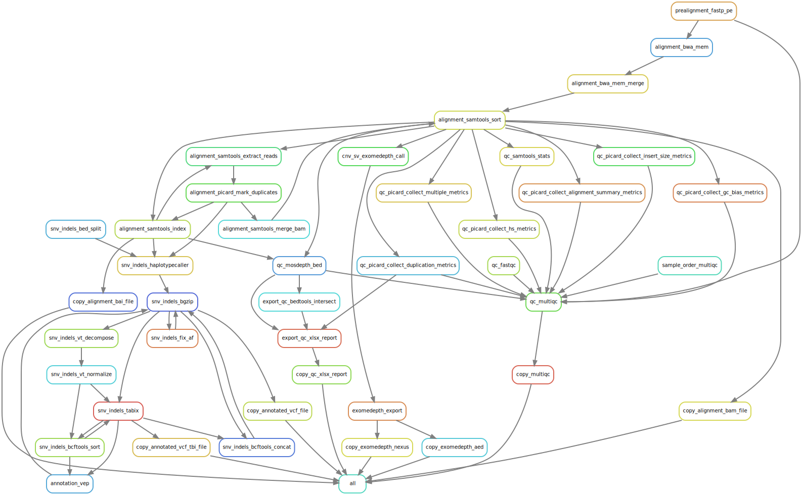

# :snake: clinical-genomics-uppsala/marple :female_detective:

#### Twist Cancer inherited hg38 hydra pipelines
---

<p align="center">
<a href="https://marple-rd-tc.readthedocs.io/en/latest/">https://marple-rd-tc.readthedocs.io/en/latest/</a>
</p>

This ReadMe is only a brief introduction, please refer to ReadTheDocs for the latest documentation. 

---


[](https://opensource.org/licenses/gpl-3.0.html)

## :speech_balloon: Introduction
This pipeline is created to run on Illumina data from a custom Twist Inherited Cancer panel, designed at Clinical Genomics Uppsala.

This snakemake pipeline uses the module system from [Hydra Genetics](https://github.com/hydra-genetics/) to process `.fastq.gz` files. The pipeline produces a MultiQC `html` report with qc-data, `.bam` alignment files, annotated `.vcf.gz` for SNVs and smaller indels, as well as `.txt` and `.aed` files for structural variants from Exomedepth. 

Marple :female_detective: uses the following hydra genetics modules:
- [Alignment](https://github.com/hydra-genetics/alignment/tree/v0.4.0)
- [Annotation](https://github.com/hydra-genetics/annotation/tree/v0.3.0)
- [CNV](https://github.com/hydra-genetics/cnv_sv/tree/78f270c)
- [Prealignment](https://github.com/hydra-genetics/prealignment/tree/v1.0.0)
- [SNV indels](https://github.com/hydra-genetics/snv_indels/tree/v0.3.0)
- [QC](https://github.com/hydra-genetics/qc/tree/ca947b1)

## :heavy_exclamation_mark: Dependencies

In order to use this module, the following dependencies are required:

[](https://github.com/hydra-genetics/)
[](https://pandas.pydata.org/)
[
[](https://snakemake.readthedocs.io/en/stable/)
[](https://sylabs.io/docs/)

## :school_satchel: Preparations

### Sample data

Input data should be added to a [`samples.tsv`](https://github.com/clinical-genomics-uppsala/marple/blob/develop/config/samples.tsv)
and an [`units.tsv`](https://github.com/clinical-genomics-uppsala/marple/blob/develop/config/units.tsv).
The following information need to be added to these files:

| Column Id | Description |
| --- | --- |
| **`samples.tsv`** |
| sample | unique sample/patient id, one per row |
|tumor_content| tumor cell content estimation|
| **`units.tsv`** |
| sample | same sample/patient id as in `samples.tsv` |
| type | data type identifier (one letter), can be one of **T**umor, **N**ormal, **R**NA |
| platform | type of sequencing platform, e.g. `NovaSeq` |
| machine | specific machine id, e.g. NovaSeq instruments have `@Axxxxx` |
| flowcell | identifer of flowcell used |
| lane | flowcell lane number |
| barcode | sequence library barcode/index, connect forward and reverse indices by `+`, e.g. `ATGC+ATGC` |
| fastq1/2 | absolute path to forward and reverse reads |
| adapter | adapter sequences to be trimmed, separated by comma |

A [`resources.yaml`](https://github.com/clinical-genomics-uppsala/marple/blob/develop/config/resources.yaml) and [`config.yaml`](https://github.com/clinical-genomics-uppsala/marple/blob/develop/config/config.yaml) also need to be available to run Marple. 

## :white_check_mark: Testing

The workflow repository contains a small test dataset (:exclamation: Todo: as of now dry-run only) `.tests/integration` which can be run like so:

```bash
$ cd .tests/integration
$ snakemake -n -s ../../workflow/Snakefile --configfiles ../../config/config.yaml config.yaml --config sequenceid="990909_test"
```

## :rocket: Usage

To use this run this pipeline `sample.tsv`, `units.tsv`, `resources.yaml`, and `config.yaml` files need to be available in the current directory (or otherwise specified in `config.yaml`). You always need to specify the `config`-file and `sequenceid` variable in the command. To run the pipeline:

```bash
$ snakemake --profile snakemake-profile --snakefile ../../workflow/Snakefile --configfile config.yaml --config sequenceid="990909_test"
```

### Output files

The following output files are located in `Results/`-folder:

| File | Description |
|---|---|
| `{sequenceid}_MultiQC.html` | `.html` file with aggregated qc values for entire run |
|`{sample}_{sequenceid}/{sample}_{sequenceid}.xlsx`| `.xlsx` file with qc (primarily coverage) stats for each sample|
|`{sample}_{sequenceid}/{sample}_{sequenceid}.bam`| Deduplicated `.bam` alignment file |
|`{sample}_{sequenceid}/{sample}_{sequenceid}.bam.bai`| Index for `.bam` file|
|`{sample}_{sequenceid}/{sample}_{sequenceid}.vcf.gz`| `.vcf` file normalized and annotated with vep|
|`{sample}_{sequenceid}/{sample}_{sequenceid}.vcf.gz.tbi`| Index for `.vcf` file|
|`{sample}_{sequenceid}/{sample}_{sequenceid}.merged.genome.vcf.gz`| A `genome.vcf` file for all variation|
|`{sample}_{sequenceid}/{sample}_{sequenceid}.merged.genome.vcf.gz.tbi`| Index for `genome.vcf` |
|`{sample}_{sequenceid}/{sample}_{sequenceid}_exomedepth_SV.txt`| `.txt` file with structural variants|
|`{sample}_{sequenceid}/{sample}_{sequenceid}_exomedepth.aed`| `.aed` file with structural variants|

## :judge: Rule Graph

