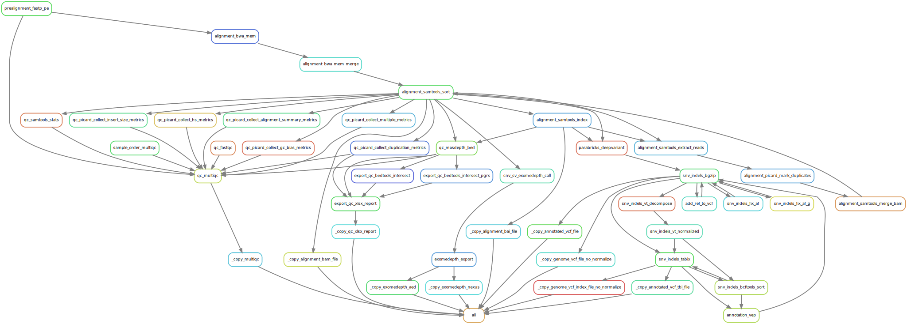

# :snake: Welcome to Marple - Inherited Cancer pipeline :woman_detective:

<a href="https://github.com/clinical-genomics-uppsala/marple_rd_tc/">https://github.com/clinical-genomics-uppsala/marple_rd_tc/</a>

This pipeline is created to run on short-read Illumina data from a custom Twist Inherited Cancer panel, designed at [Clinical Genomics Uppsala](https://www.scilifelab.se/units/clinical-genomics-uppsala/#https://www.cgu.igp.uu.se).

This snakemake pipeline uses the module system from [Hydra Genetics](https://github.com/hydra-genetics/) to process `.fastq.gz` files. The pipeline produces a MultiQC `.html` report with QC-data, `.bam` alignment files, annotated `.vcf.gz` for SNVs and smaller indels, as well as `.txt` and `.aed` files for structural variants from Exomedepth. A `genome.vcf.gz` is also produced, but this is not normalized.

 
Marple :woman_detective: uses the following hydra genetics modules:

- [Alignment](https://github.com/hydra-genetics/alignment/tree/v0.4.0)
- [Annotation](https://github.com/hydra-genetics/annotation/tree/v0.3.0)
- [CNV](https://github.com/hydra-genetics/cnv_sv/tree/78f270c)
- [Parabricks](https://github.com/hydra-genetics/parabricks/tree/v1.1.0)
- [Prealignment](https://github.com/hydra-genetics/prealignment/tree/v1.0.0)
- [SNV indels](https://github.com/hydra-genetics/snv_indels/tree/v0.5.0)
- [QC](https://github.com/hydra-genetics/qc/tree/ca947b1)

!!! warning
    As of now a GPU with licensed Parabricks is needed ro run SNV calling in Marple. A non-licensed CPU alternative will be added at a later stage.

### :judge: Rulegraph 
{: style="height:100%;width:100%"}

---
## :snake: Marple - references pipeline :woman_detective:
The repository also includes a workflow to create the normalpool needed for Exomedepth. The references pipeline is located in `workflow/Snakefile_references` and uses a specific units files `units_references.tsv` which need to include the path to a `bam`-file, preferably produced by Marple.

 
Marple - references pipeline :woman_detective: only uses one [Hydra Genetics](https://github.com/hydra-genetics/) module:

- [References](https://github.com/hydra-genetics/references/tree/907d302)

### :judge: Rulegraph

{: style="height:50%;width:50%"}

---
# Hydra-genetics

[Hydra Genetics](https://github.com/hydra-genetics/) is an organization/community with the goal of making [snakemake](https://snakemake.readthedocs.io/en/stable/index.html) pipeline development easier, faster, a bit more structured and of higher quality.

We do this by providing [snakemake modules](https://snakemake.readthedocs.io/en/stable/snakefiles/modularization.html#modules) that can be combined to create a complete analysis or included in already existing pipelines. All modules are subjected to extensive testing to make sure that new releases doesn't unexpectedly break existing pipeline or deviate from guidelines and best practices on how to write code.

There is also a small [tutorial](https://hydra-genetics.readthedocs.io/en/latest/simple_pipeline/) available to help you get started with Hydra-genetics.

# Snakemake
Marple and Hydra-genetics are snakemake bases pipeline/tools. The [Snakemake](https://snakemake.readthedocs.io/en/stable/index.html) workflow management system is a tool to create reproducible and scalable data analyses. Workflows are described via a human readable, Python based language. They can be seamlessly scaled to server, cluster, grid and cloud environments, without the need to modify the workflow definition. Finally, Snakemake workflows can entail a description of required software, which will be automatically deployed to any execution environment. 

If Snakemake is new to you a good place to start is doing the [snakemake tutorial](https://snakemake.readthedocs.io/en/stable/tutorial/tutorial.html) since this will help you setting Marple up.

